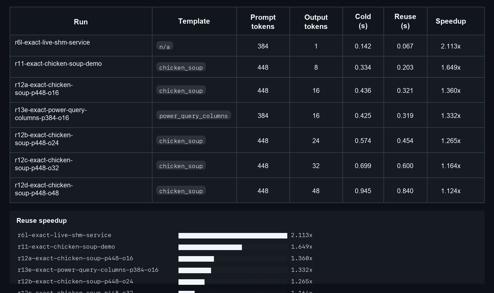

# Spyre vLLM Work Map

Last updated: 2026-03-18

This repository is the top-level map for Spyre + vLLM planning, validation, and
external dependencies. It covers:

- the current `vllm_spyre` stack
- `vllm-spyre-next`
- KV reuse, KV offload, and prefill/decode disaggregation
- multi-Spyre and distributed prerequisites
- compiler and runtime transition points in `torch-spyre`

## Current Reporting Snapshot

- [Validation and Proof Plan](./topics/validation-and-proof-plan/README.md)
  - shared evidence ladder across the current stack, next stack, and multi-Spyre work
- [Current-Stack AIU KV Status (2026-03-17)](./topics/validation-and-proof-plan/current-stack-aiu-kv-status-2026-03-17.md)
  - current-stack reuse/offload status with explicit non-claims
- [Current-Stack AIU KV Semantic Investigation (2026-03-18)](./topics/validation-and-proof-plan/current-stack-aiu-kv-semantic-investigation-2026-03-18.md)
  - follow-on AIU cold-vs-reuse correctness results for the current stack
- [Current-Stack AIU KV Data](./topics/validation-and-proof-plan/current-stack-aiu-kv-data.md)
  - ranked benchmark data, full run registry, and the published AIU prefix-cache probe

## Current Status

The current `vllm_spyre` AIU work now has two published result classes:

- positive current-stack results:
  - aligned KV reuse latency behavior on AIU
  - same-node service-backed persistence behavior on AIU
  - server-path prefix caching on AIU
- follow-on semantic investigation:
  - current-stack external KV offload/reload did not pass cold-vs-reuse
    correctness testing

Detailed notes:

- [Current-Stack AIU KV Status (2026-03-17)](./topics/validation-and-proof-plan/current-stack-aiu-kv-status-2026-03-17.md)
- [Current-Stack AIU KV Semantic Investigation (2026-03-18)](./topics/validation-and-proof-plan/current-stack-aiu-kv-semantic-investigation-2026-03-18.md)

At a glance:

- exact aligned KV reuse is working on AIU
- partial aligned KV reuse is working on AIU
- same-node service-backed KV persistence is working on AIU
- server-path prefix caching is working on AIU
- current-stack semantic cold-vs-reuse testing did not establish semantically
  correct external KV offload/reload

[](./topics/validation-and-proof-plan/current-stack-aiu-kv-data.md)

Supporting detail:

- [Current-Stack AIU KV Data](./topics/validation-and-proof-plan/current-stack-aiu-kv-data.md)
  - benchmark tables, full run registry, commands, and prefix-cache probe results
- [Current-Stack AIU KV Semantic Investigation (2026-03-18)](./topics/validation-and-proof-plan/current-stack-aiu-kv-semantic-investigation-2026-03-18.md)
  - `r17` and `r18` follow-on semantic results, including stale-reference repair

## Stack Summary

The current `vllm_spyre` path uses a larger Spyre-specific integration surface:

- custom scheduler logic
- custom worker/model-runner logic
- custom attention / KV management path
- dependence on FMS modeling code instead of upstream vLLM modeling code
- limited reuse of upstream vLLM compiler integrations

The `vllm-spyre-next` direction targets a smaller integration surface with more
upstream vLLM behavior and a larger dependency on `torch-spyre`
runtime/compiler maturity.

## Architecture Snapshot: Current Spyre Software Stack

```text
                CURRENT SPYRE SOFTWARE STACK
            (current vllm-spyre path + FMS + SendNN)

  User / OpenAI API / LLM.generate
                 |
                 v
         upstream vLLM engine core
                 |
                 v
     +----------------------------------+
     | vllm_spyre plugin                |
     |                                  |
     |  - SpyrePlatform                 |
     |  - custom scheduler              |
     |  - custom worker                 |
     |  - custom model runner           |
     +----------------------------------+
                 |
                 v
     +----------------------------------+
     | execution model                  |
     |                                  |
     |  - FMS model code                |
     |  - FMS attention / KV handling   |
     |  - custom warmup / batching      |
     +----------------------------------+
                 |
                 v
          torch.compile (Dynamo level)
                 |
                 v
              sendnn
                 |
                 v
   DeepTools / current runtime
        |
        v
       AIU
```

Properties of this design point:

- good near-term hardware enablement
- significant custom code
- FMS dependency
- no native reuse of upstream vLLM modeling code
- KV connector integration has to be added around the worker/model-runner seam
- the current AIU execution path is `torch.compile -> sendnn`

## Architecture Snapshot: vllm-spyre-next / New Stack

```text
                  VLLM-SPYRE-NEXT / NEW STACK
          (compile-native path + upstream modeling + torch-spyre)

  User / OpenAI API / LLM.generate
                 |
                 v
         upstream vLLM engine core
                 |
                 v
     +----------------------------------+
     | thinner Spyre plugin             |
     |                                  |
     |  - Spyre-specific platform       |
     |  - likely Spyre worker           |
     |  - likely Spyre model runner     |
     |  - no FMS dependency             |
     +----------------------------------+
                 |
                 v
     +----------------------------------+
     | upstream vLLM execution model    |
     |                                  |
     |  - upstream model code           |
     |  - Spyre attention backend       |
     |  - upstream scheduler behavior   |
     +----------------------------------+
                 |
                 v
        torch.compile / Inductor path
                 |
                 v
     +----------------------------------+
     | torch-spyre device/runtime       |
     |                                  |
     |  - device model                  |
     |  - allocator / tensor layout     |
     |  - stream support                |
     |  - copy path                     |
     |  - distributed backend           |
     +----------------------------------+
                 |
                 v
      current compiler contract today:
        SuperDSC-Bundle -> SpyreCode / JobPlan
                 |
      future torch-spyre compiler/backend direction:
        broader `backend="inductor"` path
                 |
                 v
                AIU
```

Properties of this design point:

- potentially far less plugin-specific code
- more direct reuse of upstream vLLM behavior
- much more dependent on torch-spyre runtime/compiler maturity
- makes multi-Spyre and distributed support much more central

## KV Reuse / KV Offload / P-D Disaggregation on the Current Spyre Software Stack

### 1. Current path: exploratory worker-side KV path

```text
   current vllm-spyre path request
         |
         v
   current scheduler emits
   kv_connector_metadata
         |
         v
   SpyreKVConnectorBridge
   (worker-side, synchronous)
         |
         v
   staging tensors <-> live FMS KV
         |
         v
   connector medium
     |           |
     |           +--> host-memory reuse store
     |
     +--> future transport / offload target
```

The important point is that the seam is worker-side and staging-based.

This was a useful current-stack experiment surface for `r17` and `r18`, but
those follow-on semantic runs did not establish semantically correct external KV
offload/reload on the current stack. Read this as an exploratory control-path
shape, not as a supported current-stack offload design.

### 2. Current path: P-D disaggregation direction

```text
 Prefill node (current vllm-spyre path) Decode node (current vllm-spyre path)
 +---------------------------+          +---------------------------+
 | vllm_spyre scheduler/     |          | vllm_spyre scheduler/     |
 | worker/model runner       |          | worker/model runner       |
 | + FMS attention/KV        |          | + FMS attention/KV        |
 +-------------+-------------+          +-------------+-------------+
               |                                      ^
               |                                      |
               +---- connector transport / KV push ---+
                         via worker-side bridge
```

This is the direction suggested by:

- current worker-side bridge work in `vllm_spyre`
- upstream vLLM connector / PD-disagg / NIXL work
- the [Spyre KV connector epic in `vllm-spyre`](https://github.com/vllm-project/vllm-spyre/issues/745)

## KV Reuse / KV Offload / P-D Disaggregation on vllm-spyre-next

### 3. New stack target shape

```text
            upstream scheduler / connector / HMA / PD logic
                               |
                               v
                 +-------------------------------+
                 | vllm-spyre-next worker/model  |
                 | runner on torch-spyre         |
                 +-------------------------------+
                               |
                               v
                upstream model code + Spyre attn backend
                               |
                               v
                     torch-spyre device tensors
                               |
                 +-------------+-------------+
                 |                           |
                 v                           v
           local offload medium         P-D disagg transport
           (host / future medium)       (prefill <-> decode)
```

Why this matters:

- the same upstream connector family could potentially cover both local
  offload and P-D disaggregation
- but that only becomes realistic once `vllm-spyre-next` can run paged attention
  and KV-carrying vLLM model code natively on torch-spyre

## Transition Map

```text
                    WHAT WE CAN PROVE FIRST

  Track A: current vllm-spyre path / current contract family
  ----------------------------------------------------------
  prove connector correctness and AIU benefit now
      |
      +--> in-memory reuse on AIU
      +--> current path offload experiments
      +--> current path P-D disaggregation experiments


  Track B: vllm-spyre-next / evolving contract direction
  ------------------------------------------------------
  reduce plugin footprint and move onto torch-spyre substrate
      |
      +--> CPU/dev-test readiness
      +--> wrapped layers + attention backend
      +--> upstream test harness
      +--> torch-spyre device/runtime/compiler prerequisites
      +--> AIU bring-up on vllm-spyre-next


  Convergence
  -----------
  once vllm-spyre-next has:
    - upstream model execution
    - paged attention backend
    - device tensors + copy/stream support
    - distributed / multi-Spyre support
    - enough compiler/runtime maturity

  then KV offload / P-D disaggregation should migrate toward the new stack and
  rely more directly on upstream vLLM connector abstractions.
```

## What We Have Actually Tested

### Local / CPU

For the current KV-reuse prototype:

- focused connector tests pass locally
- worker-side integration tests pass locally
- offline probe / benchmark harnesses exist and run locally
- local validation proves connector logic and regression safety, but not real
  transport or AIU performance

For `vllm-spyre-next`:

- the public work is currently still mostly at CPU/dev-test readiness and
  layer-by-layer enablement
- there is not yet a full AIU-backed end-to-end KV offload path on
  `vllm-spyre-next`

### AIU: current vllm-spyre path

Hardware-backed validation already completed for the current prototype path:

- exact-prefix reuse validated on AIU
- partial-prefix reuse validated on AIU
- zero-miss aligned block loads validated on AIU
- request-latency improvements measured in the single-process offline path

Observed benchmark result from the AIU-backed offline benchmark:

- exact-prefix replay (rerun the same prompt): about `1.205x` speedup, about
  `17.0%` lower request latency
- partial-prefix replay (rerun a prompt with the same prefix and a different
  suffix): about `1.179x` speedup, about `15.2%` lower request latency

Important caveat:

- this is still a single-process offline path using the current vllm-spyre
  path
- it proves reuse benefit, not yet full serving-path TTFT or multi-node P-D
  behavior
- these measurements were gathered before the recent repo sync work on the
  vLLM dependency, so they should be treated as a pre-sync AIU baseline and
  re-run on the target pinned environment before becoming the standing
  reference point

### AIU: vllm-spyre-next

Not yet validated for end-to-end KV offload / PD-disagg scenarios.

The public `vllm-spyre-next` workstream still appears to be in the phase of:

- CPU/dev-test readiness
- wrapped layer bring-up
- custom attention backend scaffolding
- compatibility with newer vLLM versions
- upstream test harness / filtering

## Near-Term Validation Order

### Phase 1: continue with the current vllm-spyre path on AIU

This is the right place to keep proving value right now because the seam
already exists and hardware validation is already working.

Recommended order:

1. keep broadening the current AIU benchmark matrix
2. add clearer scheduler-side observability
3. move from offline latency into serving-path / TTFT-oriented measurement
4. test the next transport-backed step on the current path if needed

### Phase 2: keep vllm-spyre-next moving, but do not force offload onto it too early

The new stack should be treated as the long-term convergence target, but not
as the place to prove the first AIU offload win.

Recommended order:

1. continue layer and attention backend enablement
2. keep syncing to current upstream vLLM
3. keep expanding upstream-test coverage
4. explicitly track multi-Spyre, streams, copy, and compiler/runtime
   prerequisites
5. only move KV offload / P-D disagg experiments there once the basic serving
   path is credible

## Multi-Spyre Deep Dive

### Why multi-Spyre matters here

Multi-Spyre is not only about tensor parallel inference. It matters because it
is the shared foundation for:

- tensor parallel model execution on `vllm-spyre-next`
- realistic decode-node scaling in P-D disaggregation
- collective operations used by vLLM model execution
- eventually, more advanced transport and topology-aware data movement

### Current vllm-spyre path vs vllm-spyre-next

```text
 current vllm-spyre path multi-Spyre
 -----------------------------------
 vllm_spyre + current runtime already has TP-oriented operational paths
 and topology-aware pod scheduling guidance

 vllm-spyre-next multi-Spyre
 ---------------------------
 must be built on torch-spyre's native distributed/runtime substrate:
   - distributed backend
   - stream support
   - efficient copy path
   - device-aware compiler/runtime artifacts
```

### Relevant torch-spyre work

- [RFC 0099 / PR #816](https://github.com/torch-spyre/torch-spyre/pull/816)
  - multi-Spyre distributed backend via `spyreccl`
  - explicit `torch.distributed` backend story for Spyre
  - directly relevant for `vllm-spyre-next` TP and collective support

- [PR #918](https://github.com/torch-spyre/torch-spyre/pull/918)
  - stream support for torch-spyre
  - relevant for overlap, async operations, and future copy/collective work

- [PR #1007](https://github.com/torch-spyre/torch-spyre/pull/1007)
  - graph-free copy via runtime `copyAsync`
  - directly relevant to any serious offload/transport story on
    `vllm-spyre-next`

- [RFC 0248 / PR #868](https://github.com/torch-spyre/torch-spyre/pull/868)
  - `SuperDSC-Bundle` frontend/backend contract
  - important for understanding the current compiler/runtime contract boundary

- [issue #277](https://github.com/torch-spyre/torch-spyre/issues/277) and
  [PR #1010](https://github.com/torch-spyre/torch-spyre/pull/1010)
  - `SpyreCode` / `JobPlan`
  - important because future runtime execution, copies, and correction steps
    are modeled explicitly there

- [issue #682](https://github.com/torch-spyre/torch-spyre/issues/682)
  - `KTIR`
  - one public thread within the broader future torch-spyre
    compiler/backend direction

- [issue #601](https://github.com/torch-spyre/torch-spyre/issues/601) and
  [PR #1049](https://github.com/torch-spyre/torch-spyre/pull/1049)
  - profiling toolkit, Kineto PrivateUse1 integration, FFDC, HTA direction
  - useful because once `vllm-spyre-next` becomes real, debugging and profiling
    offload / PD / multi-card behavior will depend on this tooling

### PyTorch upstream context

- [pytorch/pytorch#172154](https://github.com/pytorch/pytorch/pull/172154)
  - `privateuse1` backend integration with Kineto
  - directly supports torch-spyre profiling integration

- [pytorch/pytorch#176877](https://github.com/pytorch/pytorch/issues/176877)
  - distributed support for OpenReg
  - the best public reference today for how an out-of-tree accelerator backend
    can integrate with `torch.distributed` in a maintainable way

- [pytorch/pytorch#175954](https://github.com/pytorch/pytorch/issues/175954)
  - decomposition-table RFC
  - relevant because out-of-tree backends like torch-spyre need stable ways to
    customize Inductor behavior without fragile monkey-patching

- PyTorch dev-discuss:
  [IBM Spyre Accelerator: PyTorch Enabling Status and Feature Plan - 1H 2026](https://dev-discuss.pytorch.org/t/ibm-spyre-accelerator-pytorch-enabling-status-and-feature-plan-1h-2026/3319)
  - strongest public roadmap statement for `vllm-spyre-next` and torch-spyre
    substrate
  - especially important because it makes the multi-card plan concrete:
    compiled functional collectives first, `torch.distributed` migration
    second, and eventual `torch.comms` alignment later
  - also sharpens the 1H 2026 priorities around single-card production
    inference, attention/backend work, profiling, and vLLM integration

### Practical interpretation

For the immediate KV-offload roadmap:

- multi-Spyre is not the first proof point
- but it is a prerequisite for the serious `vllm-spyre-next` future
- so it should be tracked as a first-class dependency, not a side topic
- the March 2026 PyTorch roadmap thread makes this more explicit: multi-card
  support is a staged enablement effort on top of the PyTorch-native path, not
  something that will appear "for free" once `vllm-spyre-next` can serve on one
  card

## Public Work To Watch

### vllm-spyre

- [issue #639: `[RFC] vllm-spyre-next`](https://github.com/vllm-project/vllm-spyre/issues/639)
- [issue #745: `[Epic] Develop KVCacheConnector for Spyre`](https://github.com/vllm-project/vllm-spyre/issues/745)
- [issue #648](https://github.com/vllm-project/vllm-spyre/issues/648) paged KV-cache attention backend using torch-spyre
- [issue #647](https://github.com/vllm-project/vllm-spyre/issues/647) contiguous KV-cache attention backend using torch-spyre
- [issue #689](https://github.com/vllm-project/vllm-spyre/issues/689) layer-wise split execution in torch-spyre
- [issue #666](https://github.com/vllm-project/vllm-spyre/issues/666) run vLLM modeling code instead of FMS modeling code
- [PR #798](https://github.com/vllm-project/vllm-spyre/pull/798) custom attention backend for `vllm-spyre-next`
- [PR #826](https://github.com/vllm-project/vllm-spyre/pull/826) update vLLM and torch-spyre for `vllm-spyre-next`
- [PR #836](https://github.com/vllm-project/vllm-spyre/pull/836) wrapped embedding layer for `vllm-spyre-next`
- [PR #837](https://github.com/vllm-project/vllm-spyre/pull/837) upstream tests framework and RMSNorm tests for `vllm-spyre-next`

### upstream vLLM

- [PR #35264](https://github.com/vllm-project/vllm/pull/35264) KV push from prefill to decode node using NIXL connector
- [PR #35760](https://github.com/vllm-project/vllm/pull/35760) PD-disagg + speculative decoding acceptance tests
- [PR #36687](https://github.com/vllm-project/vllm/pull/36687) support hybrid SSM-FA models in PD disaggregation
- [PR #36957](https://github.com/vllm-project/vllm/pull/36957) heterogeneous TP in hybrid-model PD disaggregation
- [issue #36780](https://github.com/vllm-project/vllm/issues/36780) RFC for hybrid SSM-FA NIXL connector support
- [PR #37160](https://github.com/vllm-project/vllm/pull/37160) simple general CPU KV cache offloading
- PRs [#36642](https://github.com/vllm-project/vllm/pull/36642), [#36644](https://github.com/vllm-project/vllm/pull/36644), [#36645](https://github.com/vllm-project/vllm/pull/36645), [#35223](https://github.com/vllm-project/vllm/pull/35223), [#36549](https://github.com/vllm-project/vllm/pull/36549)
  - HMA / multi-group / sliding-window / recovery / multi-connector plumbing

### torch-spyre

- [PR #816](https://github.com/torch-spyre/torch-spyre/pull/816) multi-Spyre device support framework
- [PR #918](https://github.com/torch-spyre/torch-spyre/pull/918) stream support
- [PR #1007](https://github.com/torch-spyre/torch-spyre/pull/1007) graph-free copy
- [PR #1049](https://github.com/torch-spyre/torch-spyre/pull/1049) profiling toolkit RFC
- [PR #1010](https://github.com/torch-spyre/torch-spyre/pull/1010) SpyreCode / JobPlan alignment
- [PR #1011](https://github.com/torch-spyre/torch-spyre/pull/1011) tensor memory access analysis
- [PR #868](https://github.com/torch-spyre/torch-spyre/pull/868) SuperDSC-Bundle specification
- [issue #682](https://github.com/torch-spyre/torch-spyre/issues/682) KTIR
  - relevant as one part of the broader future torch-spyre
    compiler/backend direction
- [issue #183](https://github.com/torch-spyre/torch-spyre/issues/183) eager codegen through torch.compile
- [issue #200](https://github.com/torch-spyre/torch-spyre/issues/200) new allocator for VF mode

## Priorities

### Highest priority now

1. keep proving KV reuse / offload value on AIU with the current vllm-spyre
   path
2. keep refining the benchmark and observability story
3. keep tracking upstream connector / PD-disagg / HMA work in vLLM

### Strategic priority

1. track `vllm-spyre-next` as the long-term landing zone
2. track torch-spyre multi-Spyre / stream / copy / compiler-runtime work as
   explicit prerequisites
3. do not force the new stack to carry offload too early just because it is
   the more elegant end state

## Topic Maps

These topic directories are the intended higher-level landing zones for
cross-repo conversations. Each starts from first principles and then narrows
toward the current `vllm_spyre` path and `vllm-spyre-next`.

- [Topic index](./topics/README.md)
  - grouped view across architecture, KV/data movement, and scale/validation
- [Current Path and vllm-spyre-next](./topics/current-vs-next-stack/README.md)
  - umbrella for the architectural transition itself
- [Execution and Attention](./topics/execution-and-attention/README.md)
  - umbrella for where execution and live KV ownership actually sit
- [Compiler/Runtime Contracts](./topics/compiler-runtime-contracts/README.md)
  - umbrella for the lower substrate contract changes underneath both paths
- [SuperDSC and Current Contracts](./topics/superdsc-and-current-contracts/README.md)
  - deeper map of the current contract family under today’s AIU path
- [Spyre Device and Inductor](./topics/spyre-device-and-inductor/README.md)
  - deeper map of the broader torch-spyre backend/device direction
- [KTIR and Future IR](./topics/ktir-and-future-ir/README.md)
  - deeper map of future IR / artifact questions inside that broader direction
- [KV Reuse](./topics/kv-reuse/README.md)
  - umbrella for reuse, with local KV reuse as the current concrete Spyre
    focus
- [KV Offload](./topics/kv-offload/README.md)
  - umbrella for offload, with transport-backed local offload as the current
    concrete Spyre focus
- [Prefill/Decode Disaggregation](./topics/prefill-decode-disaggregation/README.md)
  - umbrella for disaggregation, with KV transfer as the key enabling seam
- [Multi-Spyre](./topics/multi-spyre/README.md)
  - umbrella for multi-device and distributed maturity
- [Validation and Proof Plan](./topics/validation-and-proof-plan/README.md)
  - umbrella for how to stage and interpret proofs across topics

## Working Links

- [Live tracker](./LIVE_TRACKER.md)
- [Topic index](./topics/README.md)
- Working research draft in `toddllm/vllm-spyre`:
  [spyre-kv-offload-research.md](https://github.com/toddllm/vllm-spyre/blob/spyre-kv-inmemory-slice/docs/roadmaps/spyre-kv-offload-research.md)
- Working RFC draft in `toddllm/vllm-spyre`:
  [spyre-kv-offload-rfc-draft.md](https://github.com/toddllm/vllm-spyre/blob/spyre-kv-inmemory-slice/docs/roadmaps/spyre-kv-offload-rfc-draft.md)

This repo is intended to be the higher-level tracking layer. Lower-level RFCs,
research notes, PRs, and implementation details should continue to live in the
most relevant source repo and then get linked here.

## Naming

To keep the discussion clear, this note uses the following names consistently.

- Primary labels for today's path:
  - `current Spyre software stack`
  - `current design point`
  - `current vllm-spyre path`
  - shorthand `current path` is acceptable once the context is already clear
  - avoid leading with `old stack` unless mirroring someone else's wording

- Working meaning of the current Spyre software stack:
  - `vllm_spyre`
  - custom `SpyrePlatform`, scheduler, worker, and model runner
  - FMS model code and FMS attention path
  - the current workaround-heavy integration surface
  - the current SendNN / DeepTools style execution path

- Primary labels for the future path:
  - `vllm-spyre-next`
  - `new stack`
  - `compile-native path` or `Inductor-native path` when the compiler/runtime
    distinction matters

- Working meaning of `vllm-spyre-next` / `new stack`:
  - intended to consume upstream vLLM modeling code directly
  - intended to rely more deeply on `torch-spyre` for the
    device/runtime/compiler path
  - intended to reduce dependency on FMS
  - intended to become the long-term home for compile-native solutions to
    limitations of the current path

- When discussing the lower substrate, prefer:
  - `current compiler/runtime contract family`
  - `future torch-spyre compiler/backend direction`

- Working meaning of the current compiler/runtime contract family:
  - the compiler/runtime path underneath the current Spyre software stack
  - today this still revolves around the existing DeepTools-oriented contracts
  - on the torch-spyre side this is still represented by `SuperDSC-Bundle` +
    `SpyreCode` / `JobPlan`

- Working meaning of the future torch-spyre compiler/backend direction:
  - the broader compiler/backend direction behind `torch.compile` with
    `backend="inductor"` on torch-spyre
  - this involves multiple lower-level changes under torch-spyre, including
    but not limited to KTIR-related work
  - from the `vllm-spyre` point of view, the important thing is the backend
    and runtime shape exposed through torch-spyre, not any one internal
    compiler artifact name

The important distinction is:

- `current Spyre software stack` vs `vllm-spyre-next` is a `vllm-spyre`
  plugin and execution-shape question
- `current compiler/runtime contract family` vs `future torch-spyre
  compiler/backend direction` is a `torch-spyre` compiler/runtime question

Those transitions are related, but they are not the same transition.
